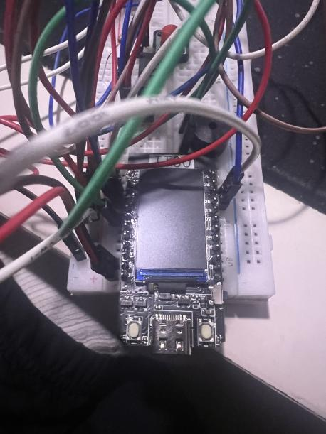
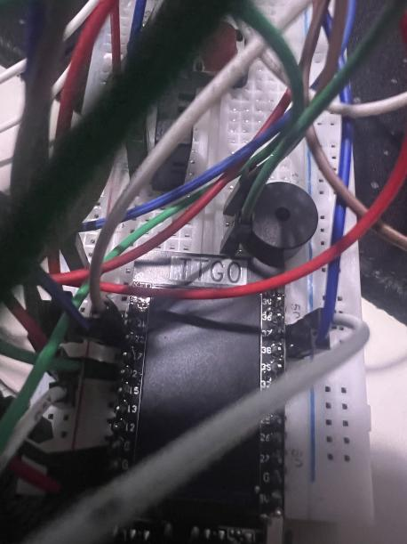
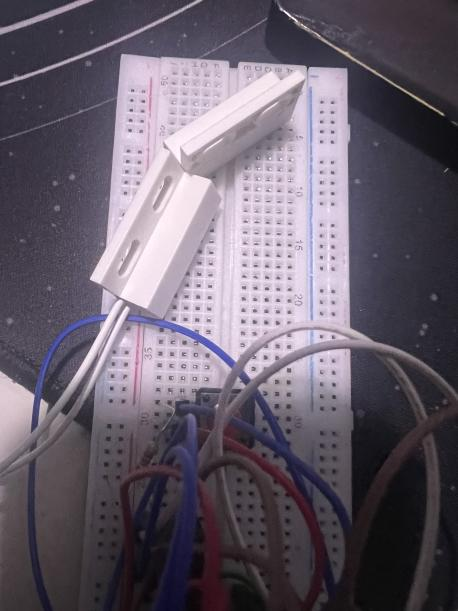
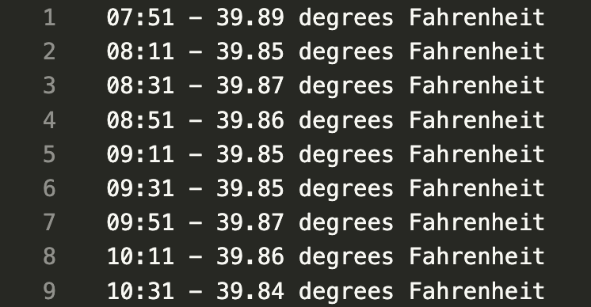
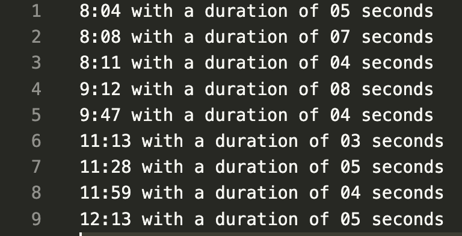

# Close-The-Door-Inator

## Link to Demo
https://www.youtube.com/watch?v=cKOuHvFHTa4&ab_channel=Sovi

## About
The main premises of the project was to implement a arduino project where it tracks activity of door status (open or close) and uploading data to the cloud. 
The hardware used for this project was buzzer actuator, physical touch button sensor, temperature sensor, magnetic door sensor, LILY TTGO ESP32 Dev Module, and miscellaneous accessories (header pins, breadboard, etc.). While it was a simple implementation, it was a very critical implementation to help prevent any financial downfalls and food waste at the bakery

## Files changed
The files changed were the main.cpp file found in the src folder, the platform.ini file, and the server.py file (used for cloud HTTP REST requests) in the home directory. 

## Hardware images

## Architecture Diagram

## Screenshots of data stored on the cloud

## Link to presentation slides
https://docs.google.com/presentation/d/1o0-59pTTqp1iY5IngkDp5_4D2ZTq8fd22uQsllwkRkU/edit?usp=sharing
